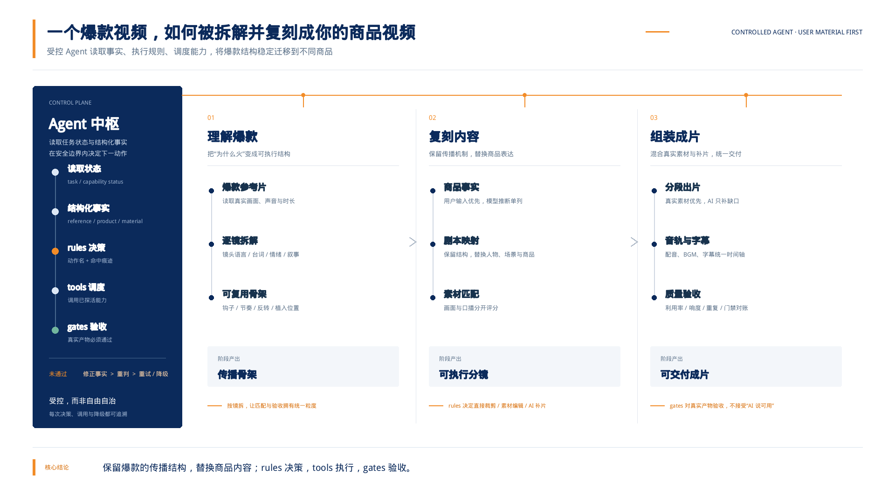
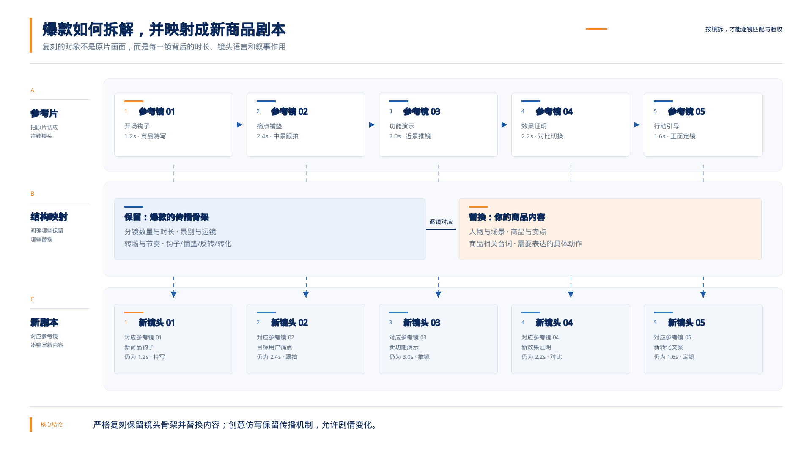
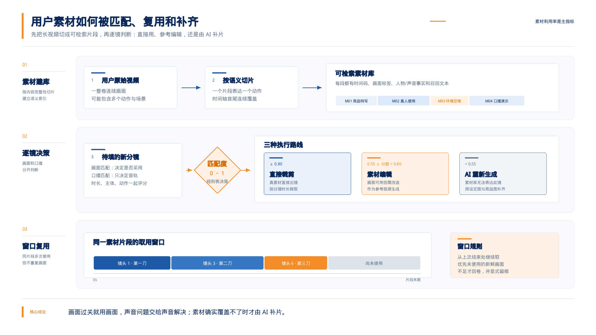

# ViralForge 系统设计链路详解

---

## 目录

- [第一部分：十分钟看懂整个系统](#第一部分十分钟看懂整个系统)
- [第二部分：九个步骤逐一拆解](#第二部分九个步骤逐一拆解)
- [第三部分：贯穿全链路的三大机制](#第三部分贯穿全链路的三大机制)
- [第四部分：工程难题与解法实录](#第四部分工程难题与解法实录)
- [第五部分：参考手册（模型、参数、产物、代码地图）](#第五部分参考手册)

---

# 第一部分：十分钟看懂整个系统

## 1.1 这个系统是做什么的

一句话：**给它一条已经火过的参考视频，加上你自己的商品信息（和可选的自有素材视频），
它自动产出一条"结构、节奏、镜头语言都和爆款一致，但内容换成你的商品"的新视频。**

关键在于"复刻"二字的理解。它不是让 AI"照着感觉再生成一条"，而是：

1. 先把爆款视频**像剧本一样拆开**——每个镜头多长、拍了什么、怎么运镜、说了什么台词、
   为什么这个镜头能抓住人；
2. 再**换题材重写**——人物、商品、场景换成你的，但每一镜的时长、景别、节奏、情绪起伏
   照着原片走；
3. 然后**优先用你自己拍过的素材**去填这些镜头，实在没有对得上的镜头才让 AI 生成补齐；
4. 最后**拼接成片**，配上音乐、口播和字幕。

## 1.2 一个贴切的类比：一家七人小型广告公司

把系统想象成一家流水线严密的小公司，每个"员工"就是一个代码模块：

| 角色                     | 干的活                                                         | 对应模块                                                |
| ------------------------ | -------------------------------------------------------------- | ------------------------------------------------------- |
| **策划**（拆片师） | 逐帧看爆款参考片，写出完整的分镜拆解报告                       | `analyze_reference.py`                                   |
| **素材管理员**     | 把你给的素材视频切成一段段，贴好标签建档                       | `analyze_materials.py`                                |
| **编剧**           | 照着拆解报告，为你的商品仿写一版新剧本                         | `write_script.py`                                     |
| **美术**           | 画人物设定图、场景概念图（给 AI 摄制组当参考）                 | `write_script.py` + `line_art.py`                   |
| **剪辑师**         | 拿新剧本逐镜头翻素材库：能用的直接裁，不能用的记下来           | `shot_match.py` / `segment_build.py`                       |
| **AI 摄制组**      | 素材填不上的镜头，调用视频生成模型现拍                         | `aigc.py` + `line_art.py`                           |
| **配音师**         | 克隆素材里的人声音色，把新台词念出来                           | `Agent_tools/tts_clone`                               |
| **后期**           | 拼接、铺音乐、烧字幕（可以连字幕样式都复刻参考片）             | `compose_video.py` + `Agent_tools/caption_clone` |
| **质检员**         | 成片后逐项复核：素材用够了吗、该有声的地方有声吗、字幕烧重了吗 | `review_case.py`                                      |

另外还有两本全公司共用的"制度手册"，后面会重点讲：

- **判定规则手册**（`rules.py`）：所有"遇到 X 情况该怎么办"的决策，都写成一张张规则表；
- **实测门禁手册**（`gates.py`）：任何素材用进成片前，必须用仪器实测过关，不能只听 AI 说。

## 1.3 全景流程图



*图 1　整条链路只有三个大动作：先把爆款读懂并抽出传播骨架，再把商品和用户素材填进骨架，
最后统一处理画面、声音、字幕和质检。左侧 Agent 中枢贯穿三层：它读取任务状态和结构化事实，
查规则得到动作，调度工具执行，再用实测门禁决定通过、重试还是降级。*

## 1.4 为什么它是"通用 Agent"，而不只是固定脚本

准确地说，ViralForge 是一个**受控工作流式 Agent**，不是让大模型自由尝试任意工具的
自治 Agent。九步主链和安全边界由代码预先定义，模型负责理解复杂语义、生成候选内容；
Agent 根据状态和规则，在允许的能力范围内选择分支、调度工具并处理失败。

它每次做决定都经过同一套闭环：

| Agent 环节     | 实际机制                                                          | 产生什么                                              |
| -------------- | ----------------------------------------------------------------- | ----------------------------------------------------- |
| **感知** | Gemini/Qwen 理解参考片和素材，ffmpeg 探测媒体，外挂 registry 探活 | 分镜、人物、口播、BGM、匹配度、工具可用性等结构化事实 |
| **决策** | `rules.decide(规则表, 事实)` 自上而下查表                       | 动作名、命中规则、所依据的事实和兜底说明              |
| **计划** | `pipeline.py` 根据九步状态机、当前产物和任务选项选择下一步      | 当前要执行的步骤、策略分支和所需能力                  |
| **调度** | 动作映射表和`Agent_tools/registry.py` 把动作名接到具体实现      | 调用理解模型、生成模型、ffmpeg、TTS、字幕或 ASR       |
| **验证** | `gates.py` 对实际产物测响度、音乐性和可用性                     | 通过/拦下及完整指标报告                               |
| **反馈** | 失败时修正事实，沿预定义路径重试、换输入或降级                    | 新一轮规则判定，或明确失败并留痕                      |

这里最关键的分工是：

> **模型给出事实和候选；rules 决定"做什么"；pipeline 决定"什么时候做"；tools 负责
> "怎么做"；gates 决定"结果能不能用"。**

它之所以能从某一个商品案例扩展为**通用爆款复刻 Agent**，不是因为有一个"万能模型"，而是：

1. **统一事实协议**：不同商品、人物、参考片和素材，最终都收敛成同一批字段；
2. **规则可配置**：匹配阈值、音轨策略、字幕策略和音色优先级集中在规则表；
3. **工具可插拔**：规则只输出稳定动作名，底层模型或工具可以替换而不改规则；
4. **任务可追溯**：状态机、断点续跑、规则痕迹和门禁报告让每次调度可恢复、可复核。

完整的 Agent 决策与能力调度关系见图 4。

## 1.5 四条底层设计原则

读懂这四条，后面所有细节都能对上号：

1. **用户素材为主、AI 补片为辅。** 用户真实拍摄的画面永远优先于 AI 生成——真实素材
   有商品的真实质感和可信度。只有素材库确实覆盖不了的镜头才交给 AI，而且系统里有
   多处"宁可降级也要用上真素材"的兜底逻辑。**素材利用率是成片的主指标。**
2. **判定口径单一来源。** 核心业务决策集中在 `rules.py` 的规则表里，实测阈值集中在
   `gates.py` 里；`pipeline.py` 负责固定主链、安全约束和已知降级。业务口径与工具实现分开，
   换阈值或优先级不用重写整条流程。
3. **显式失败，绝不静默丢内容。** 工具不可用就明确跳过并记日志；一段生成失败宁可整个
   任务停下，也不产出"悄悄少了一段"的残片；每个失败原因都写进任务档案。
4. **一切可追溯。** 每一步的中间产物（拆解报告、剧本、匹配打分、门禁报告）全部落盘。
   成片有任何问题，都能顺着档案查到"当时是哪条规则、依据什么事实做的决定"。

## 1.6 任务是怎么被管理的（状态机）

每个复刻任务 = `output/tasks/{任务ID}/` 一个目录。任务 ID 形如 `20260814-153000-a1b2`
（时间戳＋随机后缀）。目录里的 `task.json` 是任务的"病历本"，记录：

- 任务状态：`draft`（草稿）→ `running`（运行中）→ `completed` / `failed`；
- 九个步骤各自的状态、耗时、产物路径、失败原因；
- 复刻参数（options）、商品信息、输入文件清单、最近 400 条运行日志。

三个重要特性（`pipeline.py` 的 `_run_step` / `run` / `reset_from`）：

- **幂等 + 断点续跑**：重跑任务时，已完成的步骤直接跳过并复用产物。跑到第 8 步挂了，
  修好后再跑，前 7 步一秒不用等。
- **从任意步骤重置**：`reset_from(task_id, step)` 清掉某步骤及其后续的状态（产物文件保留
  作备份），只重跑需要重跑的部分。比如只想换个剧本，从 `script` 重置即可，不必重新拆参考片。
- **失败即停、原因留痕**：任何一步抛错，任务状态变 `failed`，停在当前步骤，错误信息
  写进 `task.json`，前端能直接看到。

`task.json` 的写入用"先写临时文件再原子替换"（`save()`），保证正在轮询的网页永远不会
读到写了一半的 JSON。

## 1.7 用户可调的五个复刻参数

| 参数                     | 默认       | 含义                                                                                                                                                           |
| ------------------------ | ---------- | -------------------------------------------------------------------------------------------------------------------------------------------------------------- |
| `rewrite_mode`         | `strict` | 复刻强度。`strict` 严格复刻：一镜对一镜，只换人物/商品/场景；`creative` 创意仿写：保留传播结构（钩子类型/节奏/反转位置），允许重写剧情，分镜数可浮动 ±20% |
| `use_user_materials`   | 开         | 有用户素材时优先复用，不足才 AI 生成                                                                                                                           |
| `copy_bgm`             | 开         | 把参考片的背景音乐铺到成片下面（用户单独上传了 BGM 则优先用用户的；实测参考片没有音乐就不铺）                                                                  |
| `copy_reference_audio` | 关         | 成片直接使用参考片整条原声                                                                                                                                     |
| `copy_subtitles`       | 关         | 按新剧本台词生成字幕烧进画面，并可克隆参考片的字幕样式                                                                                                         |

---

# 第二部分：九个步骤逐一拆解

每步按同一结构讲：**解决什么问题（通俗）→ 具体怎么做（专业）→ 落盘产物**。

## ① ingest —— 素材入库校验

**解决什么问题**：开工前把料备齐、验清楚，别跑到一半才发现文件是坏的。

**具体怎么做**（`pipeline.step_ingest`）：

- 硬性校验：参考视频必须有；商品名称、商品图、用户素材三者至少给一样（不然系统连
  "要推广什么"都不知道）。
- 用 ffmpeg（一个开源的音视频处理引擎，本项目自带、无需安装）探测每个文件：时长、
  文件大小、有没有音轨。
- 对三个外挂工具做"探活"（声音克隆、字幕风格克隆、词级语音识别），可用性写进日志——
  **开工时就知道哪些能力在线，而不是跑到最后一步才发现配音后端没装**。

**产物**：`assets/registry.json`（素材登记表）。

## ② reference —— 爆款参考片拆解

**解决什么问题**：把"这条视频为什么火"从一种感觉变成一份**可执行的结构化文档**。
就像把一道招牌菜逆向写出菜谱：不只记"好吃"，要记火候、克数、下锅顺序。

**具体怎么做**（`analyze_reference.py`）：

- 把整条视频交给**多模态大模型**（能同时看画面、听声音的 AI）。默认走 Gemini
  （视频转成 base64 内嵌在请求里发过去），Gemini 网关不通时自动降级到 Qwen
  （需要先把视频上传到对象存储换一个公网地址）。实际用了哪条链路记录在产物的
  「链路」字段里。
- 要求模型输出两层结构，**字段名全部用中文**（实测中文键名模型更不容易漏字段）：
  - **逐镜拆解**（"分镜"数组，每镜 15 个字段）：序号、起止时间、时长秒、景别（远景/
    中景/特写…）、运镜（推拉摇移…）、画面描述、人物、动作、场景、特效、**转场**（硬切/
    叠化/闪白…）、台词（逐字转写）、音效音乐、叙事功能（钩子/铺垫/反转/产品露出…）。
  - **整体分析**（12 个字段）：一句话概要、核心创意、开场钩子怎么做的、结构分段、
    叙事技巧、音乐、声音设计、情绪曲线（带时间采样点）、节奏统计、**镜头骨架**
    （抽象成可复用模板）、可复用模板说明、产品植入方式。
  - 另外两个**判定布尔**：有背景音乐？有人声口播？——这两个值直接供后面第③步查规则表用，
    在拆解时一次问清，省一次模型调用。
- 三道确定性的"纠偏"后处理（不依赖模型自觉）：
  - `normalize()`：模型偶尔自作主张改字段名（如把"台词"写成 dialogue），按别名映射表
    统一收敛回中文键。
  - `_fix_durations()`：**模型自报的镜头时长系统性偏短**（实测 9 镜合计 6.6 秒，实际
    12.2 秒）。先用每镜起止时间反推时长，再按 ffmpeg 实测的视频真实总长等比缩放，
    最后重建连续时间轴。不校这一步，成片会比参考片短一半。
  - `_fill_transitions()`：转场字段在长输出里最容易被漏写，缺了就拿分镜列表单独再问
    一次模型（转场是第⑥步分段的关键依据，不能缺）。

**产物**：`reference/analysis.json` ＋ 人类可读的 `analysis.md`。



*图 2　“复刻”不是把原片画面换个商品，而是保留每一镜的时长、景别、运镜、转场与叙事功能，
再替换人物、商品、场景和商品台词。新镜头始终知道自己对应哪一个参考镜头。*

## ③ audio —— 参考片音频判定

**解决什么问题**：决定成片的音乐怎么办。参考片可能是纯音乐、音乐+口播混着、
也可能根本没音乐。**AI 说"有音乐"不算数，要拿仪器量过才算**。

**具体怎么做**（`pipeline.step_audio`，判定口径在 `rules.py` 的「参考片音轨」表）：

1. 抽出参考片整条音轨。
2. 采集事实：优先用第②步拆解时已给出的两个布尔（有背景音乐/有人声口播）；缺了就把
   音频喂给模型补问一次；模型也不可用时退化为"从拆解文本推断"（有台词→有口播），
   并标明置信度只有 0.5、判定来源是推断。
3. 若参考片有音乐且需要复用，先把"将要贴进成片的那条音轨"准备出来：
   - 只有音乐没口播 → 整轨直接用；
   - 音乐口播混着 → 需要**人声/伴奏分离**。分离有三级降级链：
     首选 **demucs**（htdemucs 模型，效果最好；本机没有 GPU，用 CPU 跑，37 秒音频约
     1~3 分钟，每任务只跑一两次可接受）→ 失败退 **librosa REPET-SIM** 软掩蔽算法
     （纯数值计算，无需模型，但口播残响明显）→ 再失败退 **ffmpeg 声道中置抵消**
     （左右声道相减抵掉居中人声）。后两种会在产物里显式标注「伴奏残留人声风险」。
4. 对备好的音轨跑 **BGM 音乐性门禁**（`gates.check("BGM音乐性")`）：有声占比 ≥ 0.5、
   最长连续有声段 ≥ 5 秒（短音轨按「时长×60%」折算）、频谱平坦度 ≤ 0.35（音乐有音高
   结构，环境噪声接近白噪声）。
   三项全过才算"真音乐"。**踩过的坑**：某参考片被模型标注"有 BGM"，实测只是零星音效
   （有声占比 0.43），复刻它毫无意义还污染成片——这个门禁就是为此建的。
5. 按「参考片音轨」规则表得出动作，五种之一：用户上传音乐 / 整轨复用 / 分离伴奏 /
   不使用参考片音频（+ 兜底行）。命中的是哪张表第几行、依据什么事实，全部写进产物。

**产物**：`audio/reference_audio.json`（含策略、判定痕迹、门禁报告）、`audio/bgm.m4a`（如需分离）。

## ④ materials —— 用户素材切片

**解决什么问题**：把用户拍的素材视频变成一个**可检索的素材库**。原始视频是"一整卷胶片"，
切片后才能按需取用："我要一个 3 秒的商品特写"——查库就能找到。

**具体怎么做**（`analyze_materials.py`，多条素材并发分析，最多 3 路）：

- 多模态大模型按"内容完整性"切片（不是机械地每秒一刀）：一个片段表达一个完整动作或
  一个明确画面意图，片段之间首尾相接覆盖全片。
- 每个片段标注 17 个语义字段：起止时间、时长、片段类型（产品展示/产品使用/人物表演/
  环境空镜/细节特写…）、画面、主体、动作、场景、景别运镜、情绪氛围、声音台词（逐字）、
  视觉标签、内容标签、可用场景、限制条件、叙事功能等。
- 另外 **5 个判定布尔**（这是后面所有决策的事实基础，必须在标注时一次问清，
  不允许下游从自由文本里猜关键词）：
  - **真人出镜**：画面里有没有真人 →决定这段素材能不能当 AI 生成的参考视频（有真人会被风控拒）；
  - **真人出镜口播**：画面里的人有没有张嘴在说话 →决定音轨能不能保留；
  - **有BGM** / **有人声** →决定要不要做人声分离；
  - **模特人脸出镜**：有没有清晰人脸 →决定能不能拿这段抽帧做人物参考图。
- 每个片段生成一段**召回文本**（把各字段拼成自然语言描述），为将来接入向量检索预留——
  目前匹配靠大模型直接读文本，还没上向量库。
- 时间轴校准逻辑与第②步相同（对齐真实视频总长）。

**产物**：`assets/material_index.json`（所有素材的片段总索引，每片段带全局唯一 `片段ID`）。

## ⑤ product —— 商品事实卡

**解决什么问题**：给商品建一份标准档案（名称、品类、卖点、外观、人群、场景），
后面编剧写台词、美术画图、AI 生成商品画面全都引用这份档案，保证口径一致、**不编造事实**。

**具体怎么做**（`pipeline.step_product`）：

- 有商品图：模型看图＋用户填写的信息，整理成事实卡。**用户给的字段原样保留不改写**，
  模型推断出来的字段单独列在 `inferred_fields` 里，且明确要求"不要编造检测数据、专利、
  功效或品牌背书"。
- **没有商品图**（很常见）：启动"从素材里抠商品"链路（`harvest_product_images`）：

  1. 让模型从素材片段清单（最多喂 80 个片段）里挑出商品露出最完整清晰的 1~3 个片段，
     并给出"这个片段里商品最清楚的时间点"；
  2. 按时间点抽帧（模型给的时间点不在片段范围内就取中点兜底）；
  3. 模型判断抽出的帧是否清晰可用，并给出"这个商品需要几张什么角度的白底图才说得清"
     （最多 3 张，比如数码相机要正/侧/背面，奶粉要外包装+开罐后）；
  4. 以抽帧为参考图，用文生图模型生成**纯白底商品主图**（提示词严格要求保留外形、
     材质、配色、包装文字，不许改设计），并发生成。
  5. 商品名和卖点尽量从**素材口播的原话**里提取（把片段的"声音台词"喂给模型），不凭空编。

  - 这条链路任何一步失败都只是"少几张图"，不会中断整个任务。
- 所有商品图上传到对象存储（BOS）换成公网 URL——后面生图生视频模型只认公网地址。

**产物**：`product/fact_card.json`、`product/frames/`（抽帧）、`product/whitebg_*.jpg`（白底图）。

> 顺序上的一个刻意安排：**materials 排在 product 之前**，因为没有商品图时，
> 商品事实卡要依赖素材切片的结论去抽商品帧。

## ⑥ script —— 剧本与分段

**解决什么问题**：这是"编剧＋美术＋制片"三个工种。产出三样东西：一版换了题材的新剧本、
一套人物/场景设定图、一份"怎么分批拍摄"的分段计划。

### 6.1 仿写剧本（`write_script.write_script`）

- 喂给大模型的是参考片拆解的**摘要**：整体分析全给，分镜只给编排相关字段（时长/景别/
  运镜/转场/叙事功能/画面/动作/台词）——既省 token，也防止模型照抄参考片画面细节。
- 按 `rewrite_mode` 注入不同的"复刻强度规则"：
  - **strict**：明确告知"这是元素替换任务，不是创作任务"。分镜数量必须一致、一镜对一镜，
    时长/景别/运镜/转场/叙事功能全部对齐，只许替换人物、商品、场景和商品相关台词。
  - **creative**：复刻的是**传播机制**——保留钩子类型、结构段落、节奏分布、情绪曲线、
    产品植入位置，允许重写人物关系和剧情，分镜数可 ±20%。
- 每个新分镜必须标注**对应参考镜**是第几镜；剧本还要输出一组**复刻说明**（每条讲清：
  这个维度参考片怎么做的、我们怎么做的、为什么效果等价）——保证"像不像"这件事可解释、可审查。
- 每镜还输出「需要模特出镜」布尔（后面决定补片时要不要人物参考图）和「视频提示词」
  （给视频生成模型的一段话）。
- 台词有**语速硬约束**：每镜台词字数 ≤ 时长 × 6.5 字/秒。这个 6.5 不是拍脑袋——本地克隆
  音色实测约 5.2 字/秒，配 1.25 倍加速仍自然，所以取 6.5。参考片主播语速再快也不能照抄，
  因为成片的口播是**我们的 TTS** 念的。
- 模型输出后还有三道确定性校正（顺序执行）：
  1. `_match_total`：剧本总时长钉回参考片总长（偏差 >10% 时全体等比缩放）——防模型自己
     又把节奏压短一轮；
  2. `_cut_long_shots`：超过 6 秒的镜切成连续子镜（标「同镜续拍」）。为什么是 6 秒：下游
     的素材匹配、裁剪、字幕全部**按镜工作**，参考片里"一镜到底 20 秒口播"这种镜头拿去
     匹配素材必然一条都对不上（用户素材都是几秒的片段，实测导致素材利用率 0）。切开时
     台词按句子分给子镜，时长按各子镜分到的字数比例分配，总时长不变；
  3. `_fit_speech`：台词还是念不完的镜，从"话少的镜"借时间（每镜最多让出一半、不低于
     0.4 秒），**总时长守恒**。还差的记进「剧本告警」，出片时靠加速念白兜。

### 6.2 人物 / 场景设定图（`write_script.gen_assets`）

设定图是给 AI 摄制组的"参考照"：保证同一个角色在不同镜头里长得是同一个人、
商品在画面里就是真实商品。

- **人物设定图有个绕不开的难题**：视频生成模型 seedance 的风控会**拒收含真人人脸的
  参考图**。解法是"线稿脸"（详见第四部分 4.1）：生成"写实身体＋面部黑白线稿"的
  人物图——既过风控，又保住发型/服装/体型这些跨镜头一致性信息。
- 用户上传了**人物参考图**（希望片中就是这个人）时走升级链路：先把真人照片图生图转成
  "素描脸"（保脸型五官结构），再按剧本外观换装出全身设定图——比纯文字描述多保住
  "是同一个人"的身份信息。失败（多半也是风控）就退回文字线稿，不中断。
- **设定图里的商品不能瞎画**：文生图凭空画的"假商品"会被后续视频生成照抄进成片。
  所以先让模型批量判断"每张设定图的画面里会不会出现商品"（人物手持/穿戴/使用、场景
  陈设里有、分镜里多次同框都算出现），会出现的把**商品原图**作为参考图传入，提示词里
  用 `@图1` 锚点指到它并声明"严格保留造型配色与包装文字"。
- 场景概念图不含人脸，直接文生图；提示词强制"曝光充足、无大面积死黑"——实测暗场景
  （地牢/夜戏）很容易生成一张几乎全黑的图，当参考图毫无信息量。

### 6.3 动态规划分段（`write_script.plan_segments`）

**为什么要分段**：视频生成模型单次最多出 15 秒、最少 4 秒。一条 40 秒的片子要分成几段
分别生成再拼接。**在哪切**很讲究：切在"硬切"（画面本来就跳变）的位置，拼缝天然隐形；
切在"叠化/运镜衔接"这种连续画面中间，拼出来就是一次生硬的跳变。

- 用**动态规划**（一种求全局最优切法的算法）在所有镜头边界里选切点，最小化总代价：
  - 每多一段 +1.0（段越少越好，省生成额度）；
  - 段短于 4 秒：+3.0 ×（4 − 段长）——太短的段会被模型强制拉到 4 秒，打乱节奏；
  - 切点落在软转场（叠化/运镜衔接/匹配剪辑等）：一处 +8.0（重罚）；
  - 段没填满 15 秒：+0.3 ×（15 − 段长）（轻推着把段填满）。
- 单镜本身超过 15 秒只能镜内硬切，标记"同镜续拍：需要生成桥接帧衔接"。
- 每段产出：段号、包含的镜头序号、原始时长、生成时长（4~15 的整数）、衔接方式说明、
  涉及的场景/人物编号、是否需要模特出镜、整段视频提示词、台词列表。

**产物**：`script/script.json`（剧本＋设定图＋分段一体）＋ 可读版 `script.md`、`script/assets/*.jpg`。

## ⑦ match —— 分镜素材匹配

**解决什么问题**：剪辑师拿着新剧本逐镜头翻素材库："这一镜，库里有没有能用的？"
这是"用户素材为主"原则落地的关键一步。

**具体怎么做**（`pipeline.step_match`）：

- 一次大模型调用：把**所有分镜**（时长/景别/运镜/画面/动作/台词/叙事功能）和**所有素材
  片段**（召回文本＋限制条件）同时给它，要求为每一镜给出：
  - **匹配度 0~1**：能不能表达这一镜的动作和叙事功能、商品是否清晰、景别运镜是否接近、
    时长够不够、画面稳不稳；
  - **画面匹配**（布尔）：**从宽判**——主体对得上、能表达这类叙事作用、与台词不矛盾就算
    过。明显是别的商品/别的场景、或画面与台词自相矛盾才算不过；
  - **口播内容匹配**（布尔）：素材里的人声说的和这一镜台词是不是同一件事。**它只决定
    声音怎么处理**（对得上留原声、对不上静音重配），不影响画面是否采用。
- 匹配度查「素材匹配策略」规则表分三路：
  - **≥ 0.80 → 直接裁剪**：素材直接出镜，裁剪对齐分镜时长；
  - **≥ 0.55 → 素材编辑**：画面可用但需要改造（换商品/换背景/延长），把素材当"参考视频"
    交给生成模型编辑；
  - **< 0.55 → 重新生成**：宁可 AI 重拍，不硬凑。
- 对将要直接出镜的切片，再查「用户切片处理」规则表决定**音轨动作**（前置门槛：画面匹配
  必须为真）：

| 素材里的情况                     | 音轨动作             | 需要配音？             |
| -------------------------------- | -------------------- | ---------------------- |
| 没有真人出镜口播                 | 静音后使用           | 要（口播交给克隆配音） |
| 有人出镜说话，但说的不是这句台词 | 静音后使用           | 要                     |
| 口播对得上、没有 BGM             | 原声直接使用         | 不要                   |
| 口播对得上、但混着 BGM           | 分离 BGM 只留人声    | 不要                   |
| 音轨情况判不出来（标注缺失）     | 兜底：静音＋重新配音 | 要                     |

  **这张表背后有一次重要的教训**：早期版本把"口播内容对不上"当一票否决——但新剧本的
  台词是新写的，用户素材里说的几乎永远是别的话，结果一轮测试 12 镜全被判"不使用"，
  成片 0 帧用户素材。修正后的口径是：**画面过关就用画面，声音的问题交给声音解决**。

- 被判「不使用」但策略是"直接裁剪"的镜头，降级为"素材编辑"（画面还够当参考）。

**产物**：`edit/asset_matches.json`（每镜的片段ID、匹配度、策略、切片动作、判定痕迹、统计）。



*图 3　系统先把用户长视频切成可搜索的素材片段，再按匹配度选择直接裁剪、素材编辑或 AI 补片；
同一片段被多次使用时，取用游标持续向后推进，避免每一刀都从片头开始造成画面重复。*

## ⑧ generate —— 分段出片（全链路最复杂的一步）

**解决什么问题**：把每一段真正做出来。段内可能一半镜头裁用户素材、另一半 AI 生成，
还要配上口播。相当于剪辑师、AI 摄制组、配音师三方协同。

**具体怎么做**（`pipeline.step_generate`，多段并发，默认 3 路）：

### 8.1 开工前的三项全局准备

1. **素材编辑降级检查**（`_demote_edit_rows`）：策略为"素材编辑"的镜头，如果这条素材
   当不了参考视频（里面有真人出镜——必被风控拒；或放慢到极限也凑不够 5 秒——太短控不住
   画面），但画面本身已过门槛，就**降级回"直接裁剪"**。宁可原样用真素材，也不丢给 AI 重演。
2. **补片的模特策略**（查「切片缺失补片」规则表）：需要 AI 补的段落里如果要出现人，
   人从哪来？四种动作：不需要人脸就直接生成 / 已选素材里有模特人脸 → 抽一帧转线稿当
   参考（全任务只做一次并缓存，保证各段是同一个人）/ 多段都要模特 → 共用一张生成的线稿
   设定图 / 只有一段要 → 纯文字描述生成。
3. **全片音色基准**（`_voice_plan`，查「音色优先级」表）：配音的音色从哪来？优先级：
   - **用户视频原声**：从素材里抽一段真人声当克隆基准（带 BGM 先分离提纯）；候选是个
     队列，逐个用**克隆基准音门禁**实测（平均响度必须 > −38 dB）——踩过的坑：有素材被
     标注"有人声"，实测是 −42.6 dB 的底噪，拿去克隆只会克出"噪音嗓"；
   - **AI 视频片段**：素材里一条人声都没有时，先串行跑生成块，从第一个出声的 AI 片段里
     提纯人声当全片基准，后续所有配音锚定它（保证全片是同一把嗓子）；
   - 基准音统一抽成单声道 wav，取 2~12 秒（生成模型的参考音只收 wav/mp3、单段 2~15 秒，
     格式不对整条请求会被拒；克隆工具内部再降到 16kHz，原因见 4.3「参考音采样率」）。

### 8.2 段内分块

把每段按"能不能直接裁素材"切成连续的**块**（`_seg_blocks`）：连续可裁的镜头并成一个
"裁剪块"，连续裁不动的镜头并成一个"生成块"。**必须并块**——生成模型最短出 4 秒，
如果一镜一块，一个 0.4 秒的快切镜头也会被撑成 4 秒，既费额度又毁节奏。

### 8.3 裁剪块的处理（用户素材路线）

顺序很讲究：**先配音、后裁画面**。

1. 把这一块的台词合成念白（克隆音色，去掉"角色："前缀防止被念出来）。**为什么先配音**：
   分镜时长照的是参考片语速，TTS 念得慢，按计划时长裁完画面再贴音，必然砍掉半句话。
2. 算画面要不要放长（`_dub_scale`）：念白装不下时，先允许念白加速（上限 1.4 倍，再快
   明显失真），还不够就放长画面（上限 1.5 倍，再长会压掉后面段落的节奏）。
3. 逐镜裁剪（`cut_clip`）：素材比需要的短时用变速放慢补足（上限 1.6 倍），再长就截断；
   统一缩放到成片分辨率、帧率。放长画面时**优先多取素材里没用过的真实画面**，不够才放慢。
4. **取用窗口管理**（`_ClipWindows`）：同一素材片段被多个镜头选中时，每一刀从上一刀
   结束的位置接着取，防止成片同一画面出现两次；新鲜画面不足 1 秒才回卷复用，并显式
   标记（质检会看）。
5. 按第⑦步定好的切片动作处理音轨：保留原声 / 静音（用静音轨占位而不是删音轨——拼接
   要求每段都有音轨）/ 分离 BGM 只留人声。
6. 把念白贴回：短了补静音，长了先加速再截断（截断秒数记录进产物，质检会报）。

### 8.4 生成块的处理（AI 补片路线）

1. 组装提示词：块内镜头自己的画面描述（**不能照抄段级提示词**——段里已被裁掉的镜头会被
   AI 再演一遍）→ 交给大模型按 `Skills/SeedancePromptSkill.md` 规范重写（素材绑定
   `@图片N`、镜头1/2/3 分拍、一个镜头只允许一种运镜、动作量化、情绪外化）→ 强制前缀
   "保持无字幕。无bgm。"（音乐字幕统一由第⑨步处理，模型自己配的乐拼接时接不上）→
   出口再机械清洗一遍音乐标记（模型看了规范里的示例很容易照抄出配乐来）。
2. 参考素材：人物线稿图/模特线稿帧＋商品原图（最多 9 张）；若有可用的素材片段
   （无真人、≥5 秒）就同时传**参考视频**做"素材编辑"。
3. 调用生成（`line_art.gen_video_safe`，带三级风控降级，见 4.1），外加两条定向重试：
   - 参考**音色**被拒（音频格式问题）→ 丢掉参考音色重试（只损失音色相似度，保画面）；
   - 参考**视频**被真人风控拒 → 若这些镜头的素材本来就能直接出镜，**直接抛回去改裁
     素材**（真素材优先于 AI 重演）；否则丢掉参考视频，退参考图生视频。
4. 生成结果裁回计划时长（模型最短出 4 秒，短块会多出一截）。
5. **静音检测补配音**（`_fill_silent_dub`）：生成模型时不时返回静音音轨，有台词的块实测
   平均音量 ≤ −45 dB 就用克隆音色把这句话补上——音色略有差别可以接受，凭空少一句话不行。

### 8.5 汇总与硬校验

- 各块按段归位拼接（不同来源的分辨率/编码不同，走归一化拼接）。
- **任何一段失败，整步失败**，错误原因逐段列出。绝不产出"静默缺一段"的成片。
- 统计"用户素材镜头数 vs AI 补片镜头数"写进任务档案（这就是素材利用率的分子）。

**产物**：`generated/segments.json`、`generated/segments/seg_*.mp4`、`generated/clips/`（裁剪明细）、
`audio/voice_plan.json`（音色方案与判定痕迹）、`audio/dub_seg*.wav`（每块念白）。

## ⑨ compose —— 拼接与音轨字幕

**解决什么问题**：后期合成。把所有段拼成一条片，铺音乐，烧字幕。

**具体怎么做**（`pipeline.step_compose`）：

1. **归一化拼接**（`produce_video.concat`）：每段先统一到同一分辨率（按 9:16 画幅、短边
   720，即 720×1280）、30fps、H.264 编码、44.1kHz **双声道** AAC 音轨（没音轨的补静音轨）。
   为什么连声道数都要统一：拼接用的是"流复制"模式，一条流里声道数中途从单声道变双声道，
   后续编码器会直接报错（实测混了克隆配音段和 AI 生成段的成片会随机拼不上）。
2. **音轨**（`_apply_audio`，按第③步的判定结果执行）：
   - 复刻原声开 → 成片音轨整体替换为参考片原声；
   - 复刻 BGM 开 → 把备好的 BGM 轨循环铺底，与成片人声混音。混音参数有讲究：
     `normalize=0`（默认混音会把两路各砍半音量，人声会突然变轻）＋限幅器 0.95（防两路
     叠加爆音）。**BGM 不压低、原声直取**是产品定的口径；
   - 都关 → 保留各段自带的生成音（人声与画面内音效）。
3. **字幕**（查「字幕复刻」规则表，三分叉：不烧 / 风格克隆 / 基础排版）：
   - 先**逐片检测画面里是否自带字幕**（AI 生成的片段有时会自己带字），自带的片跳过，
     避免"上下两行同一句话"。检测结果带缓存（按文件内容指纹＋判定口径版本，片重新生成
     过就自动重测）；按"片"而不是按"段"检测——段内混合出片后，不能因为一块自带字幕就
     让整段（含大量用户素材）都不上字幕。
   - 台词时间轴按**每片实际时长**摊（不是按剧本计划时长）——用户素材片和 AI 片的时长
     误差来源不同，按段平摊会互相传染，字幕就对不上画面了。
   - **风格克隆**（`caption_clone` 工具）：把参考片的字幕**样式**搬过来——抽帧让视觉模型
     逐帧读参考片字幕的字体感觉、颜色（从原生帧像素校准取色）、位置、密度节奏，形成
     "风格档"（跨任务缓存，同一条参考片第二次复刻省掉几分钟）；对成片跑**词级语音识别**
     得到逐字时间（识别不可用时退化为按台词窗口线性铺字，字幕仍能烧只是逐字时间不准）；
     大模型按风格档拆块、配色、配位置；生成 ASS 字幕烧录。失败自动回退基础排版。
   - **基础排版**：白字底部居中。自己按成片分辨率计算折行（字号 42px、左右边距 56px、
     底边距 72px、一屏最多两行，中文按全角宽度算，英文不切在单词中间）。**必须自己写
     ASS 而不是让 ffmpeg 直接烧 SRT**：SRT 没有分辨率信息，渲染器会按默认 384×288 解释
     字号再拉伸，字会放大 4 倍多直接冲出画面。找不到中文字体时只产出 SRT 文件不烧。

**产物**：`render/final.mp4`（成片）、`render/stitched.mp4`（纯拼接版）、`render/with_audio.mp4`、
`render/subtitles.srt/.ass`、`render/subtitle_check.json`（自带字幕检测缓存）。

## ⑩（附）成片自检 —— review_case.py

不是流水线的一步，而是每轮出片后的**质检工序**：`python3 review_case.py <task_id>`。
只读产物文件＋用 ffmpeg 量音量，**不调用任何大模型**——同一把尺子，量多少轮都不漂移。

检查项：

| 检查                           | 判定                                                                                                                                                |
| ------------------------------ | --------------------------------------------------------------------------------------------------------------------------------------------------- |
| 素材利用率                     | 用户素材镜头数 ÷ 总镜头数。**重点**：0 利用率要分两种——素材库本来就没有能出镜的片段（合理）vs 有能裁的素材却一镜没用（缺陷，违反产品原则） |
| 素材窗口重叠                   | 同一素材片段的取用窗口重叠 = 成片同画面出现两次（显式标记过"回卷"的除外）                                                                           |
| 成片时长                       | 与剧本计划差 >25% 报问题                                                                                                                            |
| 逐片音量                       | 该有口播的片实测接近静音（< −45 dB）→ 报"该说话没声"；没台词的镜静音是设计，不报                                                                  |
| 配音截断 / 画面放长 / 策略降级 | 逐条列出留痕                                                                                                                                        |
| 字幕                           | 相邻重复（剧本本来就重复的台词不算）、时间交叠、越过片尾、标记烧了却读不到字幕文件                                                                  |
| **门禁对账**             | 扫全部产物里的门禁报告，凡"门禁没过（通过=False）却被使用（使用=True）"一律记违规——新加的门禁自动被对账覆盖，不用改质检代码                       |

---

# 第三部分：贯穿全链路的三大机制

这三个机制不属于某一步，而是整个系统的"制度设计"，也是这套代码最值得借鉴的部分。


*图 4　Agent 先把不同任务归一成结构化事实，再由 rules 输出可追溯的动作名；pipeline 根据
状态机选择当前分支并调度已探活的 tools，gates 对真实产物做验收。失败结果会返回规则层，
触发事实修正、重试或降级。底部四块说明了同一内核为什么能适配不同商品和不同工具。*

> 一句话看懂：**rules 决定做什么，pipeline 决定何时做，tools 负责怎么做，gates 决定
> 结果能不能用。**

## 3.1 规则是数据：Agent 的决策手册（rules.py）

**通俗版**：所有"遇到什么情况怎么办"的决策，不写成散落在代码里的 if-else，而是写成
**一张张表格**。要改决策口径，改表里一行就行；要审查决策逻辑，跑一条命令
（`python3 rules.py`）就能把全部规则渲染成一份 markdown 总表（`output/rules.md`）人工通览。

系统里共 **5 张规则表 + 1 个优先级列表**：

| 表           | 决定什么                                                       | 在哪步用 |
| ------------ | -------------------------------------------------------------- | -------- |
| 用户切片处理 | 每条命中的素材切片怎么用（原声/静音/分离BGM/不用）＋要不要配音 | match    |
| 切片缺失补片 | AI 补片时模特怎么出镜（直接生成/抽帧线稿/共用线稿图/文字描述） | generate |
| 素材匹配策略 | 匹配度 → 直接裁剪（≥0.80）/ 素材编辑（≥0.55）/ 重新生成     | match    |
| 参考片音轨   | 参考片音乐怎么复刻（用户音乐/整轨/分离伴奏/不使用）            | audio    |
| 字幕复刻     | 字幕走风格克隆/基础排版/不烧                                   | compose  |
| 音色优先级   | 配音音色从哪来（用户原声 > AI片段 > 克隆给静音切片）           | generate |

所有表共用一套严格语义（`rules.decide()` 实现）：

- **自上而下取第一条命中**，每张表最后一行必须是无条件兜底行（漏了直接抛错）；
- 规则里不写某字段 = 通配（什么值都行）；
- **事实缺失（None）只能被通配吃掉，绝不等值命中某条规则**——某个维度没采集到，不会
  被误当成"否"走进错误分支；
- 「动作」只是名字，具体实现由管线侧的动作映射表对接——换实现不用动规则表；
- 每次判定返回**完整痕迹**（哪张表、第几行、依据的事实），原样写进产物 JSON——排查时
  能直接看出"这一条为什么这么处理"；
- 自带**覆盖自检**（`coverage_holes()`）：穷举布尔字段的全部组合，列出"只能落到兜底行"
  的组合供人工确认——加字段最容易出的问题（某些组合谁都不命中、静默走兜底）被制度化
  地暴露出来。

### 3.1.1 rules 怎么驱动 tools

规则表本身**不导入也不调用工具**，它只返回稳定的动作名；管线把动作名映射到函数或执行分支。
这样"策略"和"实现"可以各自变化：

```text
AI / 媒体探测得到事实
  → rules.decide(...) 返回「直接裁剪 / 静音后使用 / 需要配音」和命中痕迹
  → pipeline 按当前步骤查动作映射、检查工具探活状态
  → 调用 cut_clip / ffmpeg / tts_clone 等具体能力
  → gates 实测结果
  → 通过则进入成片；不通过则修正事实后重判，或按预定义路径降级
```

例如某分镜的素材匹配度是 `0.86`，画面匹配但口播内容不匹配：

1. 「素材匹配策略」表返回**直接裁剪**；
2. 「用户切片处理」表返回**静音后使用 + 需要配音**；
3. `pipeline` 调度 ffmpeg 裁剪并静音，再在声音能力可用时调用 TTS；
4. 生成的声音还要经过「有声内容」门禁；未通过不能标记为已使用；
5. 规则表、命中行、输入事实、工具动作和门禁结果一起写入任务产物。

换成另一个商品时，变化的是参考片内容、商品事实和匹配结果；这套
「事实 → 规则 → 动作 → 工具 → 验收」协议不变，因此不需要为每个品类重新写一条流水线。

## 3.2 实测门禁（gates.py）

**通俗版**：**AI 的标注只是"假设"，不是事实。** 任何媒体资产在被用进成片之前，必须对
"将要使用的那个文件"用确定性的工具（ffmpeg/数值计算）实测过关。这就像食品出厂前的
质检仪器——供应商（AI 模型）说合格没用，得自己量。

两个真实教训催生了这套机制：

- 某素材被模型标注"有人声"，实测平均响度 −42.6 dB（底噪水平），拿去克隆音色只会克出
  "噪音嗓"；
- 某参考片被标注"有 BGM"，实测只是零星音效（有声占比 0.43），复刻过来毫无意义。

**3 个门禁**（全项目阈值单一来源）：

| 门禁       | 指标与阈值                                                | 判不出时                                                  |
| ---------- | --------------------------------------------------------- | --------------------------------------------------------- |
| 有声内容   | 平均响度 > −45 dB（静音线）                              | **拦下**                                            |
| 克隆基准音 | 平均响度 > −38 dB                                        | **拦下**（来路不明的音频不许当克隆基准）            |
| BGM 音乐性 | 有声占比 ≥ 0.5 且 最长连续有声 ≥ 5s 且 谱平坦度 ≤ 0.35 | **放行**（判定器坏了不该连累 BGM 被丢，维持旧行为） |

制度要点：

- 每个门禁 = 指标函数 + 阈值 + **判不出策略**（放行/拦下，按后果声明）+ 口径说明，
  全部集中声明在一张表里；调用方只喊 `check(门禁名, 文件)`，不自带阈值；
- 报告是标准件 `{"门禁","通过","指标","判据","原因"}`，原样写进产物；谁真用了这份资产
  就在报告上加 `"使用": True`；
- **复核自动对账**：`review_case` 扫全部产物，"通过=False 且 使用=True"一律记违规。
  新加门禁自动纳入对账，质检代码零改动。

## 3.3 可追溯与断点工程

- 每步产物落盘为独立文件（JSON 为主，关键的配 markdown 可读版）；
- 决策带痕迹（规则表/命中行/事实）、生成带参数（最终提示词/参考图/重试与降级记录）、
  失败带原因（写进 task.json 对应步骤）；
- 多处**内容指纹缓存**避免重复花钱花时间：模特线稿帧全任务缓存一次、字幕自带检测按
  文件指纹缓存、参考片字幕风格档跨任务缓存、BOS 上传按内容指纹去重（同内容不重传）；
- 断点续跑 + 任意步骤重置（见 1.6），配合缓存，"改一处只重跑一处"。

---

# 第四部分：工程难题与解法实录

这一部分回答"为什么代码里有这么多绕来绕去的处理"——每一处都对应一个真实撞过的坑。
非专业读者可以把本节当"幕后花絮"读。

## 4.1 真人人脸风控：线稿替身链路

**问题**：视频生成模型 seedance 拒收含真人人脸的参考图/参考视频（风控），而"角色跨镜头
长得一致"恰恰最需要人脸参考。错误码还和普通参数错误共用一个（40000002），只能按错误
文案判断（"real person" / "sensitive" 等关键词）。

**解法**（`line_art.py`，一条经过量化验证的链路）：

1. 视觉模型把原图人物读成**文字外观描述**（性别年龄/发型发色/服装/体型，不写五官）；
2. 文生图画一张**"写实身体＋面部黑白线稿"替身图**当参考。提示词用"材质拼接"写法：
   面部声明为独立的矢量线稿介质，发际线与颈部是明确的材质分割带——只说"脸是线稿、
   身体写实"会让线稿扩散到全身；头发必须保持写实（线稿化会变白发，丢掉发色信息）；
3. 写实感靠**具体的相机光学参数**＋"实体照片扫描件"声明压住（实测 12/12 判为实拍；
   只写"4K写实摄影"基线是 4/12，三分之二会出成插画风）；
4. 视频生成时提示词**最前面**注入一段"占位符声明"（REAL_ACTOR_HINT）：明确告诉模型
   线稿脸是"需要被替换成真人脸的占位符"（实测 5/5 生效）——否则成片里人物会顶着一张
   白色线稿脸。

配套的自动降级（`gen_video_safe`）：原参考图直接生成 → 被风控拒 → 参考图逐张转线稿
重试 → 再被拒 → 丢参考图纯文字生成。只有确认是风控拒绝才降级，其他错误直接抛出。

根目录的 `face_*_seedance.py`、`run_face_lineart_trials.py`、`skin_prompt_trials.py`、
`eval_line_art.py` 都是这条链路的实验脚本，不在主链路上——上面那些"12/12""5/5"的
结论就是它们跑出来的。

## 4.2 生成模型的各种硬限制及应对

| 限制                                           | 应对                                                                                             |
| ---------------------------------------------- | ------------------------------------------------------------------------------------------------ |
| 单段只能生成 4~15 秒                           | 动态规划分段（≤15s）；短块生成后裁回计划时长；连续裁不动的镜头并块生成（防 0.4s 镜头被撑成 4s） |
| 参考图最多 9 张、参考视频 3 条、参考音频 3 条  | 参考图按"人物在前、商品在后"排序后截断                                                           |
| 参考音频只收 wav/mp3、单段 2~15 秒             | 基准音统一转 wav；被拒时只丢参考音重试（音色退化但画面保住）                                     |
| 参考音频不能是唯一的参考输入                   | 纯文字生成的块提前丢掉参考音，不等模型报错                                                       |
| 参考视频短于 1.8 秒硬报错、短于 5 秒控不住画面 | "素材编辑"要求参考片段 ≥5 秒（放慢 1.6 倍后仍不够就不做编辑）                                   |
| 生成结果时不时静音/没音轨                      | 逐片实测响度，有台词却 ≤ −45 dB 就用克隆音色补配音                                             |
| 模型会自作主张配乐、加字幕                     | 提示词强制前缀"保持无字幕。无bgm。"＋出口机械清洗音乐标记；音乐字幕统一由 compose 铺             |

## 4.3 声音链路的坑

- **TTS 语速比真人慢**：剧本层先按 6.5 字/秒约束台词长度；出片时"先配音后裁画面"，
  念白装不下依次用：念白加速（≤1.4×）→ 仍放不下再拉长画面（优先多取真素材，≤1.5×）
  → 截断（记录进产物，质检必报）。
- **克隆会连响度一起克**：参考素材本身很轻（−39 dB）时，产出配音混上 BGM 几乎听不见。
  所以 TTS 产出一律做两遍响度归一（loudnorm 到 −16 LUFS）。
- **参考音采样率分两层**：任务层的 `voice_base.wav` 为兼容视频模型保存成 44.1kHz 单声道；
  交给 VoxCPM2 前，克隆工具内部再抽成 16kHz prompt。VoxCPM2 的音频编码率就是 16kHz，
  在克隆工具里直接喂 44.1kHz 反而会因多一道重采样滚降变闷。
- **VoxCPM2 的 ultimate 模式（连参考转写一起喂）音色更贴但不可控**：实测会把参考音的
  原话也念出来、或吞掉文案开头，所以默认 basic 模式（产出就是目标文案，不多不少）。
- **本机没有 GPU**：VoxCPM2 单条合成吃满约 30 核 CPU（4 秒音频约 131 秒），并发跑三条
  会互相拖到超时全灭——所以配音全局加锁一次只跑一条，并发额度留给网络端的视频生成。
- **静音不能用"删除音轨"实现**：拼接要求每段都有音轨，少一条直接拼不上——静音用
  "无声音轨"占位。
- **贴配音时 apad+shortest 会让 ffmpeg 挂死**（无限流收不住，实测跑 5 分钟不结束）——
  必须自己把音轨裁到画面长度。

## 4.4 剪辑与字幕的坑

- **同一素材被多镜头选中**：不管理取用窗口的话，每一刀都从素材开头裁，成片同画面出现
  两次。`_ClipWindows` 按片段维护游标，每刀顺延；真用尽了才回卷并显式标记。
- **字幕时间轴按"片"摊而不是按"段"摊**：用户素材片按分镜时长裁、AI 片裁回计划时长，
  两种误差按段平摊会互相传染，字幕漂移。
- **SRT 直接烧会字号爆炸**：SRT 无分辨率信息，libass 按 384×288 解读字号再放大到画面，
  字会大 4 倍冲出屏——必须自己写 ASS，声明真实分辨率。
- **中文不会自动折行**：libass 只在空格处折行，中文没有空格——折行必须自己按全角宽度算。
- **AI 片段可能自带字幕**：逐片视觉检测，自带的时间窗不再叠加我们的字幕，风格克隆链路
  还要把这些窗口作为"禁烧区间"传下去，防止补漏逻辑把字填回去。

## 4.5 模型调用层的容错（aigc.py）

- **两条理解链路互备**：默认 Gemini（内网网关，媒体 base64 内联，支持音频）；网关是
  一组会漂移的内网 IP，逐个轮试＋显式代理＋指数退避重试 3 次；全挂了自动回落 Qwen
  （OpenAI 兼容协议，媒体走公网 URL）。调用方不感知用的是哪家。
- **成功判据不能只看 HTTP 200**：网关的业务错误藏在 `status.code` 里。
- **模型输出的 JSON 从不直接信**：统一的解析器容错（剥代码块围栏、截取首尾大括号），
  布尔值统一收敛（true/是/有 → True；判不出 → None，绝不猜）。

---

# 第五部分：参考手册

## 5.1 用到的模型与外部服务

| 用途                                      | 模型/服务                                                          | 说明                                     |
| ----------------------------------------- | ------------------------------------------------------------------ | ---------------------------------------- |
| 视频/音频理解（拆解、切片、音频判定）     | gemini-3.1-pro-preview                                             | 内网网关，base64 内联；不通自动回落 ↓   |
| 图文理解回落链路 / 快速判断（字幕检测等） | ali-qwen3.7-plus（VLM）                                            | OpenAI 兼容协议，媒体需公网 URL          |
| 文本创作（剧本、匹配打分、提示词重写）    | ali-qwen3.7-max（LLM）                                             | temperature 0.2，支持 json_mode          |
| 生图（设定图、白底商品图、线稿）          | doubao-seedream-5.0                                                | 出图 1664×2368（网关要求 ≥368 万像素） |
| 生视频                                    | doubao-seedance-2.0                                                | 4~15s、9:16，参考图≤9/视频≤3/音频≤3   |
| 声音克隆                                  | VoxCPM2（本地，CPU）                                               | zero-shot，独立 conda 环境子进程         |
| 词级语音识别（字幕逐字时间）              | Qwen3-ASR-0.6B ＋ ForcedAligner-0.6B（本地）                       | 不可用时字幕退化为线性铺字               |
| 人声/伴奏分离                             | demucs htdemucs（本地 CPU）→ librosa REPET-SIM → ffmpeg 声道抵消 | 三级降级                                 |
| 文件中转                                  | 百度 BOS 对象存储                                                  | 本地文件 → 预签名公网 URL，内容指纹去重 |
| 剪辑/探测/烧字幕                          | ffmpeg（imageio-ffmpeg 自带二进制）                                | 无需系统安装，主链路不需要 GPU           |

## 5.2 关键参数速查

| 参数                                     | 值                            | 含义                                      | 所在             |
| ---------------------------------------- | ----------------------------- | ----------------------------------------- | ---------------- |
| DIRECT_USE_SCORE                         | 0.80                          | 匹配度 ≥ 此值直接裁剪素材                | rules.py         |
| EDIT_SCORE                               | 0.55                          | ≥ 此值做素材编辑，低于则重新生成         | rules.py         |
| MAX_SLOWDOWN                             | 1.6×                         | 素材短于分镜时的最大放慢倍率              | media.py         |
| REF_CLIP_MIN                             | 5.0s                          | 素材编辑用参考片段的最短长度              | segment_build.py |
| MIN_SEG / MAX_SEG                        | 4s / 15s                      | 生成段时长下限/上限                       | write_script.py  |
| SHOT_MAX                                 | 6.0s                          | 单镜上限，超了切子镜                      | write_script.py  |
| SPEECH_RATE                              | 6.5 字/s                      | 台词语速上限                              | write_script.py  |
| DUB_MAX_TEMPO                            | 1.4×                         | 念白最大加速                              | pipeline.py      |
| DUB_MAX_STRETCH                          | 1.5×                         | 画面最大放长                              | pipeline.py      |
| SILENT_DB                                | −45 dB                       | 静音线                                    | gates.py         |
| VOICE_MIN_DB                             | −38 dB                       | 克隆基准音响度门槛                        | gates.py         |
| MUSIC_MIN_COVER / MIN_RUN / MAX_FLATNESS | 0.5 / 5s / 0.35               | BGM 音乐性三指标                          | gates.py         |
| VOICE_BASE_MIN / MAX                     | 2s / 12s                      | 克隆基准音取用长度                        | pipeline.py      |
| seg_workers                              | 3                             | 分段出片并发数                            | pipeline.py      |
| 归一化画布                               | 720×1280 @30fps              | 按 9:16 短边 720，音轨 44.1kHz 双声道 AAC | produce_video.py |
| 字幕排版                                 | 字号42px、边距56/72px、2行/屏 | 基础排版参数                              | pipeline.py      |

## 5.3 任务目录产物地图

```text
output/tasks/{task_id}/
├── task.json                    # 任务档案：状态、参数、九步进度、日志、结果
├── assets/
│   ├── uploads/                 # 用户上传的原始文件
│   ├── registry.json            # ① 素材登记表
│   └── material_index.json      # ④ 素材片段总索引
├── reference/analysis.json/.md  # ② 参考片拆解
├── audio/
│   ├── reference_audio.json     # ③ 音轨判定（策略+痕迹+门禁报告）
│   ├── reference.m4a / bgm.m4a  # 参考片音轨 / 分离出的伴奏
│   ├── voice_plan.json          # ⑧ 音色方案（来源+门禁+弃用候选）
│   ├── voice_base.wav           # 克隆基准音
│   └── dub_seg*.wav             # 各块念白
├── product/
│   ├── fact_card.json           # ⑤ 商品事实卡
│   ├── frames/ whitebg_*.jpg    # 素材抽帧 / 生成的白底商品图
├── script/
│   ├── script.json / script.md  # ⑥ 剧本+设定图+分段
│   └── assets/char_*.jpg scene_*.jpg
├── edit/asset_matches.json      # ⑦ 逐镜匹配结果（打分/策略/切片动作）
├── generated/
│   ├── segments.json            # ⑧ 出片结果（逐段逐片，含模式与降级记录）
│   ├── segments/seg_*.mp4       # 各段视频
│   ├── clips/                   # 裁剪的素材切片与参考片段
│   └── model_ref.json           # 模特线稿帧缓存
└── render/
    ├── final.mp4                # ★ 成片
    ├── stitched.mp4 / with_audio.mp4 / with_subs.mp4 / with_capfx.mp4
    ├── subtitles.srt / .ass     # 字幕文件
    ├── subtitle_check.json      # 自带字幕检测缓存
    └── capwork/                 # 字幕风格克隆的中间产物（风格档/ASR/字幕清单.md）
```

## 5.4 代码地图

| 文件                           | 行数级    | 职责                                                                                                   |
| ------------------------------ | --------- | ------------------------------------------------------------------------------------------------------ |
| `pipeline.py`                | ~2400     | 核心编排：九步状态机、幂等续跑、匹配/出片/合成的执行逻辑                                               |
| `write_script.py`            | ~850      | 仿写剧本、设定图、动态规划分段                                                                         |
| `produce_video.py`           | ~470      | ffmpeg 工具库（归一化/拼接/时长探测）＋早期批量端到端链路＋Seedance 提示词优化                         |
| `analyze_reference.py`          | ~340      | 参考片拆解                                                                                             |
| `analyze_materials.py`       | ~330      | 用户素材切片                                                                                           |
| `rules.py`                   | ~310      | 5 张判定规则表＋音色优先级＋覆盖自检                                                                   |
| `aigc.py`                    | ~290      | 模型调用统一入口（LLM/VLM/生图/生视频/Gemini 双链路）                                                  |
| `gates.py`                   | ~220      | 实测门禁（指标/阈值/判不出策略/对账原语）                                                              |
| `line_art.py`                | ~200      | 真人风控规避（线稿替身链路＋安全生成降级）                                                             |
| `review_case.py`             | ~185      | 成片自检                                                                                               |
| `server.py` + `web/`       | ~640      | Flask API＋单页前端（建任务/上传/跑/重置/看产物，Bearer 口令鉴权，后台线程跑管线，前端轮询 task.json） |
| `storage.py`                 | ~75       | BOS 上传下载                                                                                           |
| `Agent_tools/registry.py`    | ~60       | 外挂工具接入规范：挂路径、灌配置、探活；未就绪明确跳过不崩链路                                         |
| `Agent_tools/tts_clone/`     | ~300+后端 | VoxCPM2 声音克隆（子进程隔离、响度归一、超时兜底）                                                     |
| `Agent_tools/caption_clone/` | ~2700     | 字幕风格克隆（风格档/逐字流/编排/ASS 烧录/取色校准/缓存）                                              |
| `Skills/*.md`                | —        | 提示词工程规范（Seedance/生图/视频），生成前由 LLM 按规范重写提示词                                    |
| `face_*_seedance.py` 等      | —        | 线稿链路的实验脚本，不在主链路                                                                         |

## 5.5 怎么跑

| 入口                      | 用法                                                                                                                                     |
| ------------------------- | ---------------------------------------------------------------------------------------------------------------------------------------- |
| **Web（正式入口）** | `./start_web.sh`，默认端口 8420，口令在 `config.env` 的 `VF_WEB_TOKEN`。建任务 → 传素材 → 点运行 → 看九步进度与产物 → 下载成片 |
| CLI 调试                  | 改`pipeline.py` 的 `main()` 里的参数后 `python3 pipeline.py`                                                                       |
| 单模块调试                | `analyze_reference.py` / `analyze_materials.py` / `write_script.py` / `produce_video.py` 均可独立执行                               |
| 规则/门禁总表             | `python3 rules.py` → `output/rules.md`；`python3 gates.py` → `output/gates.md`                                                 |
| 成片质检                  | `python3 review_case.py <task_id>`                                                                                                     |

依赖极轻（`requirements.txt` 仅 4 项：requests、bce-python-sdk、imageio-ffmpeg、flask）。
主链路不需要 GPU：模型全走 API，本地只做 ffmpeg 剪辑；声音克隆与词级 ASR 是可选外挂，
不就绪时对应能力明确跳过，整条链路照常出片。

## 5.6 图表源文件

本文 4 张核心图同时保留三种格式：

- `figures/vf01_overview.*`：全景链路；
- `figures/vf02_decompose_mapping.*`：爆款拆解与剧本映射；
- `figures/vf03_material_reuse.*`：素材匹配、复用与 AI 补片；
- `figures/vf04_architecture_quality.*`：通用 Agent 决策、工具调度与验证闭环。

其中 `.png` 用于文档展示，`.svg` 是可缩放矢量源；对应的可编辑 Excalidraw 文件和自动布局
中间文件位于 `figures/src/`。修改 `figures/src/render_enterprise_figures.py` 后运行
`bash figures/render.sh`，即可统一重绘图片和图源。
